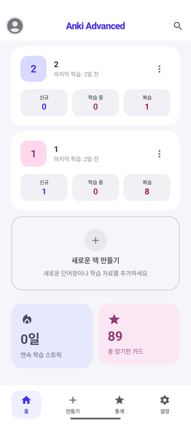
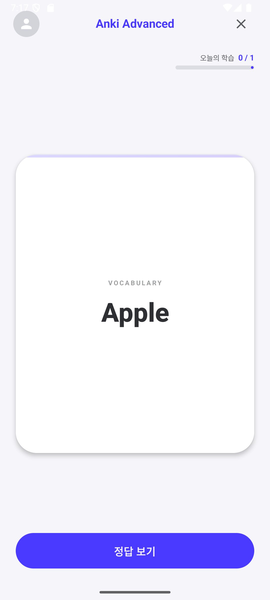
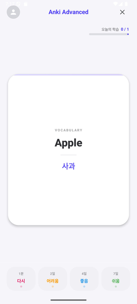
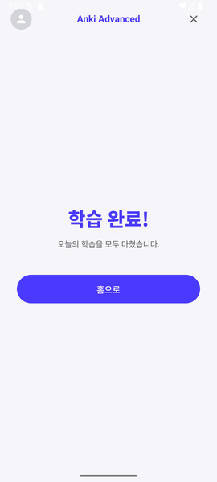
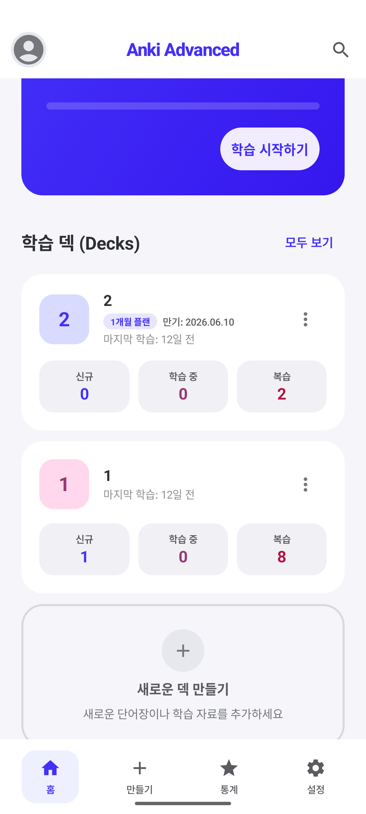
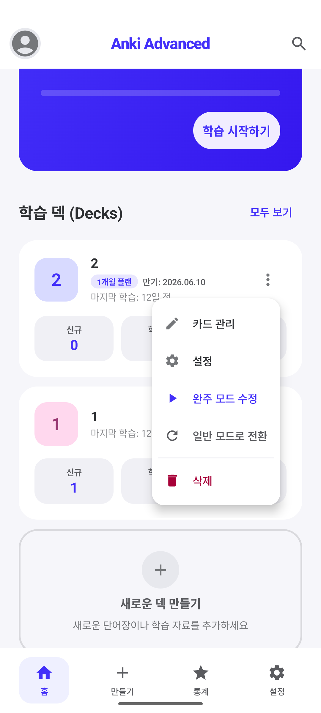
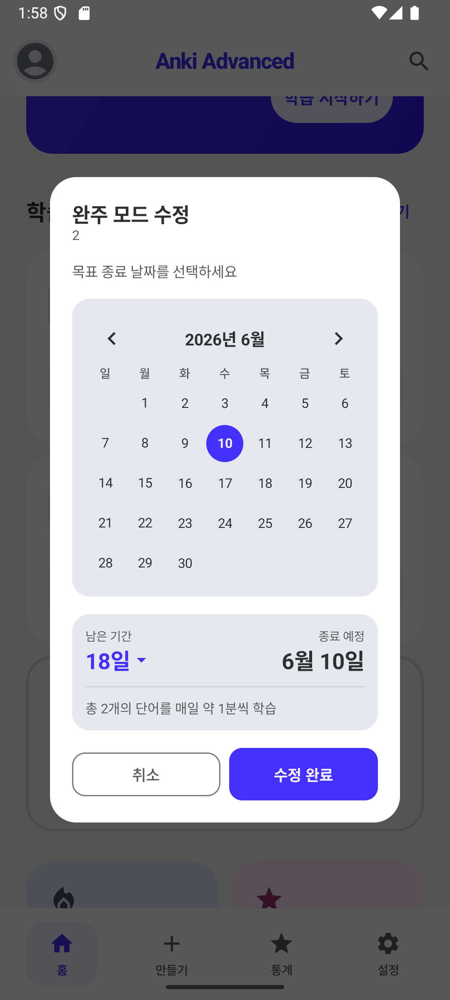

# Anki Advanced

스마트 플래시카드 학습 앱

## 개요

- **개발 목표**: 기존 Anki를 넘어 범용성·개인화·취약 카드 학습을 갖춘 발전된 학습 도구 제공
- **서비스 대상**: 시험·면접 준비, 외국어 학습, 자격증 준비 등 반복 암기가 필요한 모든 사용자
- **주요 특징**: 사용자 개인화와 범용성에 특화된 망각곡선 기반 플래시카드 학습 앱

## 기존 서비스 분석

| 서비스 | 핵심 기능 | 장점 | 한계점 |
|---|---|---|---|
| Anki (기존) | SM-2 알고리즘, 간격반복 학습 | 무료·오픈소스, 강력한 커스터마이징 | UI 복잡, 모바일 UX 열악, 카드 생성 수동 작업 필요 |
| Quizlet | 플래시카드, 게임형 학습 | 직관적 UI, 대용량 공유 덱 | SM-2 없음, 개인화 알고리즘 부재 |
| Duolingo | 언어 특화, 게임형 반복 | 높은 동기유발, 체계적 커리큘럼 | 언어 학습 전용, 범용 카드 불가 |
| Notion | 자유로운 메모, 학습 노트 | 자유도 높음, 다양한 활용 | 간격반복 없음, 복습 알림 부재 |

## 왜 새로운 앱이 필요한가?

1. **카드 생성의 번거로움**: 기존 Anki는 카드를 하나씩 수동으로 작성해야 하며, 강의 노트·교재·이미지를 바로 카드로 변환하는 기능이 없음
2. **시험 일정 연동 부재**: D-day 기반 학습 강도 조절 기능이 없어 시험이 3일 뒤인데 interval이 30일로 잡히는 비효율 발생
3. **취약 카드 관리 없음**: 계속 틀리는 카드를 별도로 모아 집중 학습하는 기능이 부재해 전체 덱을 반복하다 보면 비효율 발생
4. **범용성 부족**: Anki는 외국어에 특화, Quizlet·Duolingo는 도메인 제한으로 의학·코딩·자격증·취업 면접 등 다양한 분야 지원 미흡

## 차별화 포인트

- **LLM 카드 자동 생성**: 텍스트·이미지·문서를 입력하면 Gemini API가 자동으로 카드 생성 (경쟁 앱에 없는 핵심 차별점)
- **완주 모드 (Completion Mode)**: 시험 D-day 설정 시 SM-2의 interval 상한선을 자동 조절해 시험 준비에 최적화
- **약점 카드 자동 감지**: Again 누적 횟수 기반으로 취약 카드를 자동 분류하여 집중 학습 세션 제공
- **오버레이 학습**: 유튜브·브라우저 위에 플로팅 카드 표시, 다른 앱 사용 중에도 학습 가능
- **범용 템플릿**: 외국어뿐 아니라 수식·코드·연표·일반 Q&A 등 다양한 분야 템플릿 제공
- **압박 모드**: 제한 시간 + 되돌리기 없음으로 실전 같은 긴장감 있는 학습 환경 조성

## 기술 스택

**아키텍처**

```
UI Layer       Jetpack Compose
      ↓
ViewModel       StateFlow + MVVM
      ↓
Repository      데이터 추상화 계층
      ↓
Local DB        Room DB v2.6.1
      ↓
Backend         Firebase Functions
      ↓
AI Engine       Gemini API
```

| 항목 | 내용 |
|---|---|
| 플랫폼 | Android (API 26+) |
| 언어 | Kotlin |
| UI 프레임워크 | Jetpack Compose |
| 로컬 DB | Room DB v2.6.1 |
| 학습 알고리즘 | SM-2 (SuperMemo) |
| 동기화 | Firebase Firestore |
| AI 백엔드 | Firebase Functions + Gemini API |

## 기술 구현 — 학습 화면 흐름

홈 화면 (덱 목록 + D-day) → 학습 화면 앞면 (질문) → 학습 화면 뒷면 + 4단계 채점 → SM-2 알고리즘 완료 화면

| 홈 화면 | 학습 화면 (앞면) | 학습 화면 (뒷면) | 완료 화면 |
|---|---|---|---|
|  |  |  |  |
| 덱 목록 + D-day | 질문 | 4단계 채점 | SM-2 알고리즘 완료 |

- 카드 플립 애니메이션
- 4단계 채점 (다시 / 어려움 / 좋음 / 쉬움)
- 실행취소 (Undo)
- 오늘 학습 진행률 프로그레스 바
- SM-2 interval 계산

## 기술 구현 — 완주 모드 (Completion Mode)

D-day 기반 학습 강도 자동 조절

| 덱 배지 + 기한 표시 | 완주 모드 관리 메뉴 | 캘린더 날짜 선택 |
|---|---|---|
|  |  |  |

- **목표 날짜 설정**: 캘린더 팝업에서 시험 D-day 선택, 덱 배지에 남은 일수 실시간 표시
- **interval 상한선 자동 조절**: SM-2 알고리즘의 interval 상한선을 기간에 맞게 유동적으로 축소
- **만료 처리**: 기간 만료 후 자동 변경 없음, 사용자가 직접 재설정

## 기술 구현 — LLM 기반 카드 자동 생성

프롬프트 엔지니어링으로 유형별 카드 생성 제어

**카드 타입** (LLM이 생성 시 결정): Fact(일반) / Code(코드) / Formula(수식) / Timeline(연표)

**학습 유형** (카드마다 부여): 플래시카드 / 빈칸 채우기 / 설명하기

**학습 방식** (세션·덱 단위 토글): 역방향(뒷면→앞면) / 타이핑(직접 입력)

### 2단계 프롬프트 전략

**1. 유형 분류기**
```
입력 텍스트를 분석해서 카드 유형을 판단해줘.
유형: [qa, code, formula, timeline, cloze]
JSON으로 반환: {"type": "code"}
```

**2. 유형별 생성기 (Few-shot)**
```
예시 입력: 피타고라스 정리
예시 출력: [{"front":"세 변의 관계?","back":"a²+b²=c²","type":"formula"}]
이제 아래 텍스트로 카드를 만들어줘: {입력}
```

## 향후 계획

### Phase 1 — 핵심 기능 완성
- 압박 모드 구현 (제한 시간 + 언두 없음)
- 약점 카드 자동 감지 세션
- D-day 통계 시각화 (망각곡선)
- 알림 기능 (복습 카드 알림)

### Phase 2 — AI & 범용화
- LLM 기반 카드 자동 생성 (Gemini API)
- 수식·코드·연표 템플릿 추가
- 오버레이 (다른 앱 위에 표시) 기능
- 다양한 분야 공식 덱 제공

### Phase 3 — 플랫폼 확장
- Firebase 계정 & 멀티 디바이스 동기화
- 오픈소스 덱 공유 마켓플레이스
- 유료 구독 (공식 덱 + LLM 횟수 확장)
- iOS 포팅 검토
